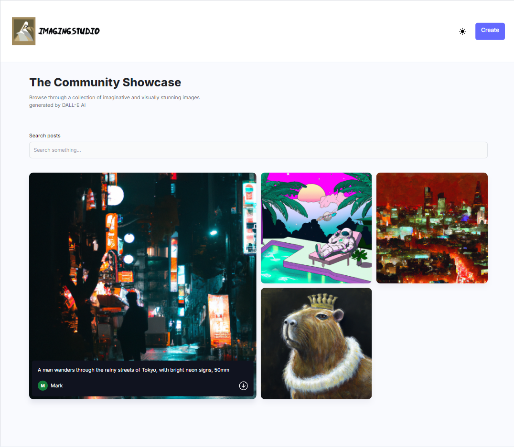
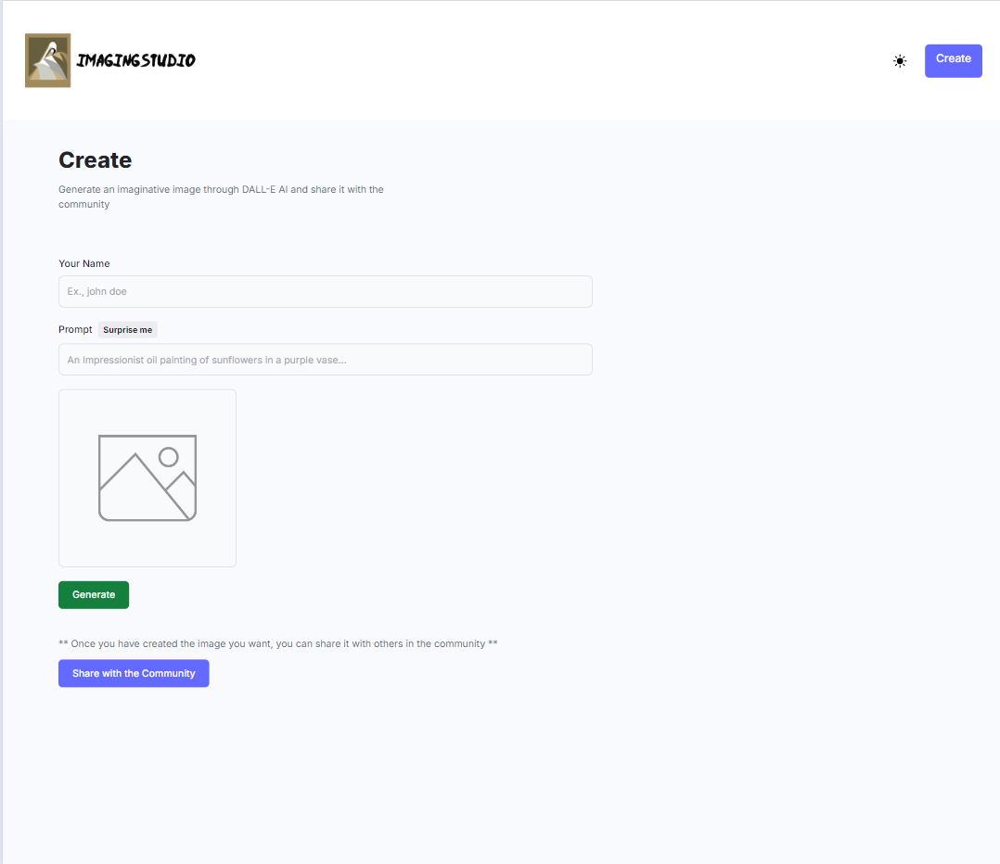

# 🤖 ImagingStudio

[](https://github.com/MarkiyanCh1/ImagingStudio)

Dive into the world of artificial intelligence and build your own version of these tools that can generate everything for your websites. ImagingStudio is a web application that will create Ai generated images from the OpenAi API, this is an amazing project that can be used both for fun and for job.

## 🌐 Live Website

- The application is live and hosted on Vercel. You can access it [here](https://imagingstudio.vercel.app/).

## 📸 Screenshot

- Home Page
  

- Image Create Page
  

## 🌟 Features

- Create image with AI
- Choose predetermined prompts by clicking on `"Surprise me"`
- Create your own prompt
- Save your images and Share it with others
- View all your images on `Home page`
- Download your images to your computer any time

## 📄 Pages

1. **Home Page**: The landing page where yiu can see all your images.
2. **Create Page**: The page where you can create a new image.

## 🛠️ Technologies Used

- **React**: A JavaScript library for building user interfaces, used latest React 18 features.
- **React Router**: A standard routing library for React.
- **NodeJS**: A JavaScript runtime environment used to build server-side applications and APIs.
- **OpenAI**: A powerful AI system that generates realistic images and art from text descriptions.
- **Cloudinary**: A cloud-based platform for managing images and videos, often used for image storage and delivery.
- **MongoDB**: A flexible NoSQL database that can store and manage large amounts of unstructured data.
- **TailwindCSS**: A utility-first CSS framework that provides a rapid way to style web applications.

## 🚀 Installation

To install and run this project locally on your machine, follow the steps below.

1. Clone the repository:

```bash
git clone https://github.com/MarkiyanCh1/ImagingStudio.git
```

2. Navigate into the project directory:

```bash
cd ImagingStudio
```

3. Navigate into the server file:

```bash
cd server
```

4. Install the server dependencies:

```bash
npm install
```

**Set Up Environment Variables**

Create a new file named `.env` in the root of your project and add the following content:

```env
OPENAI_API_KEY
MONGODB_URL

CLOUDINARY_CLOUD_NAME
CLOUDINARY_API_KEY
CLOUDINARY_API_SECRET
```

5. Start server:

```bash
npm start
```

The server will starte on port 8080 and connect mongoDB

6. Return into the project deirectory:

```bash
cd ..
```

7. Navigate into the client file:

```bash
cd client
```

8. Install the client dependencies:

```bash
npm install
```

9. Start the application:

```bash
npm run dev
```

The application will start running on http://localhost:5173.

## 🤝 Contributing

Contributions are welcome! Please open an issue or submit a pull request.

---

## If you find this project useful, please consider giving it a star ⭐. Your support is greatly appreciated!

Happy coding! 💻
